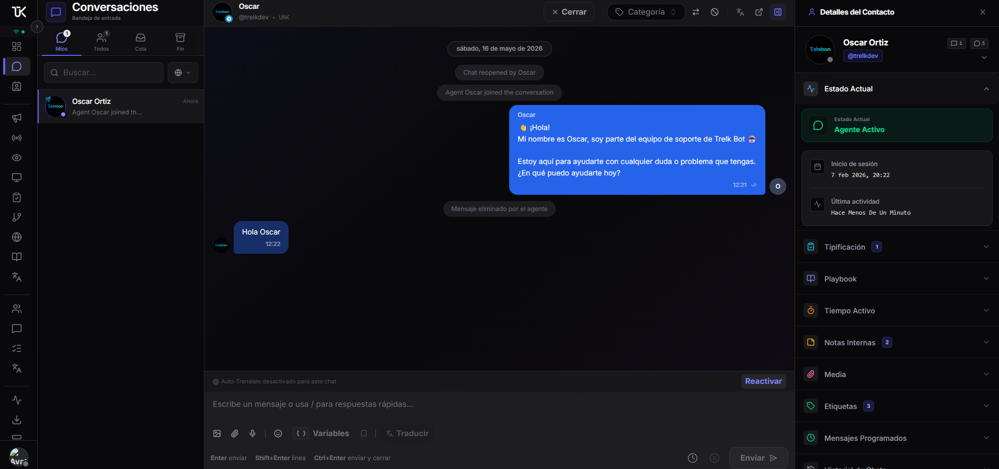

<div align="center">

# 🤖 Trelk Support Platform

**Production-grade omnichannel support system — Telegram bot, real-time agent dashboard, and embeddable WebChat widget**

[](./LICENSE)
[](https://nodejs.org)
[](https://www.typescriptlang.org)
[](https://fastify.dev)

</div>

<p align="center">
  
</p>

---

## 🚀 Demo

> 🔗 **Live Demo:** https://support.trelkbot.com  
> 🤖 **Bot:** [@TrelkSupportBot](https://t.me/TrelkSupportBot)

---

## 🧠 What problem does it solve?

Most SaaS products run customer support through disconnected channels — Telegram, web chat and email don't talk to each other. Agents lose context, users repeat themselves, and teams have no visibility.

**Trelk Support** unifies all channels into a single real-time dashboard:  agents receive Telegram messages, WebChat sessions and internal broadcasts all in one view, with full context, RBAC roles, audit logs and automated flows running in the background.

---

## ⚙️ Tech Stack

| Layer | Technology |
|---|---|
| Runtime | Node.js 22, TypeScript 5 |
| HTTP Framework | Fastify 5 |
| Real-time | Socket.IO 4 |
| Database | MongoDB 7 + Mongoose |
| Cache / Queues | Redis 7 + BullMQ |
| Bot API | Telegram Bot API (webhook + polling) |
| Auth | JWT + bcrypt + TOTP (MFA) |
| Docs | OpenAPI 3 / Swagger UI |
| DevOps | Docker, docker-compose, GitHub Actions |

---

## 🏗 Architecture

```
src/
├── channels/          # Adapter layer — Telegram, WebChat, WhatsApp (pluggable)
├── config/            # Typed env config with validation
├── database/
│   ├── connection.ts  # Mongoose connection with health monitoring
│   └── models/        # 60+ Mongoose schemas with indexes
├── middleware/        # Auth (JWT+RBAC), rate-limit, input sanitizer, security headers
├── routes/            # Fastify route handlers (thin controllers)
├── services/          # Domain logic — one file per concern
├── types/             # Shared TypeScript interfaces
└── workers/           # BullMQ workers (scheduled msgs, flow engine, cleanup, inactivity)
```

### Key design decisions

**Adapter pattern for channels** — `channels/base.adapter.ts` defines a contract; each channel (Telegram, WebChat, WhatsApp) implements it independently. Adding a new channel doesn't touch existing code.

**Write-behind cache** — Hot data (agent status, session state) lives in Redis. A `cache-models.service.ts` syncs dirty records to MongoDB asynchronously, reducing DB write pressure under high load.

**BullMQ for all async work** — Scheduled messages, flow executions, inactivity timers and cleanup jobs are BullMQ queues. Jobs survive server restarts and can be monitored via Bull Board.

**Policy Engine** — Rule-based decision layer that validates destructive operations (close chat, reassign, etc.) before execution. Pluggable and independently testable.

**Full reconciliation on boot** — After a crash or deploy, `reconciliation.service.ts` marks all agents offline and requeues orphaned chats so no conversation is lost.

---

## 🔥 Key Features

- **Omnichannel inbox** — Telegram + WebChat in one unified dashboard
- **Real-time Communication** — Socket.IO with presence detection and typing indicators
- **Automation Flows** — Visual flow engine with conditions, delays and actions
- **RBAC** — Granular role/permission system with audit trail
- **MFA** — TOTP two-factor authentication for agents
- **Smart Routing** — Skill-based and round-robin assignment
- **Broadcast** — Send to user segments with receipt tracking
- **Scheduled Messages** — Persist through restarts via BullMQ
- **QA Reviews** — Supervisor can rate and annotate closed conversations
- **Export** — Excel/CSV export of sessions and messages
- **Webhook idempotency** — Duplicate Telegram updates are safely ignored
- **Graceful shutdown** — Flushes all pending writes before exiting

---

## 📸 Architecture Diagram

```
┌─────────────────────────────────────────────────────────────┐
│                     Trelk Support Platform                   │
│                                                             │
│  ┌──────────────┐   ┌──────────────┐   ┌────────────────┐  │
│  │  Telegram    │   │   WebChat    │   │   WhatsApp     │  │
│  │  Adapter     │   │   Adapter    │   │   Adapter      │  │
│  └──────┬───────┘   └──────┬───────┘   └───────┬────────┘  │
│         └──────────────────┼──────────────────-─┘           │
│                            ▼                                 │
│                   ┌──────────────────┐                      │
│                   │  Channel Manager │                      │
│                   └────────┬─────────┘                      │
│                            │                                 │
│          ┌─────────────────┼─────────────────┐              │
│          ▼                 ▼                  ▼              │
│   ┌─────────────┐  ┌─────────────┐  ┌──────────────┐       │
│   │  Chat       │  │  Flow       │  │  Broadcast   │       │
│   │  Service    │  │  Engine     │  │  Service     │       │
│   └──────┬──────┘  └──────┬──────┘  └──────┬───────┘       │
│          └────────────────┼────────────────-┘               │
│                           ▼                                  │
│              ┌────────────────────────┐                     │
│              │  MongoDB + Redis Cache │                     │
│              └────────────────────────┘                     │
│                           │                                  │
│                           ▼                                  │
│              ┌────────────────────────┐                     │
│              │  Socket.IO Dashboard   │                     │
│              │  (Agent Workspace)     │                     │
│              └────────────────────────┘                     │
└─────────────────────────────────────────────────────────────┘
```

---

## 🧪 Running locally

### Requirements
- Node.js 22+
- Docker & docker-compose (recommended)

### Option A — Docker (fastest)

```bash
cp .env.example .env
# Fill in SUPPORT_BOT_TOKEN and JWT_SECRET in .env
docker compose up
```

API available at `http://localhost:8443`

### Option B — Local Node.js

```bash
# 1. Clone and install
npm install

# 2. Configure
cp .env.example .env
# Edit .env — at minimum set SUPPORT_BOT_TOKEN, JWT_SECRET, POLLING_ENABLED=true

# 3. Start MongoDB and Redis
docker compose -f docker-compose.dev.yml up mongo redis -d

# 4. Run
npm run dev
```

### Option C — Full dev with Docker

```bash
docker compose -f docker-compose.dev.yml up
```

---

## 🔑 Environment Variables

See [`.env.example`](./.env.example) for all variables with descriptions.

Critical ones:

| Variable | Description |
|---|---|
| `SUPPORT_BOT_TOKEN` | Telegram bot token from @BotFather |
| `JWT_SECRET` | Random 64-byte hex string |
| `MONGODB_URI` | MongoDB connection string |
| `POLLING_ENABLED` | `true` for local dev, `false` in production |
| `WEBHOOK_URL` | Public URL where Telegram sends updates |

---

## 📖 API Documentation

When `NODE_ENV !== production` (or `SWAGGER_ENABLED=true`), Swagger UI is available at:

```
http://localhost:8443/docs
```

---

## 🧠 Technical Decisions

### Why Fastify over Express?
Schema-based validation, built-in TypeScript support, and 2-3x better throughput. The plugin architecture avoids global middleware spaghetti.

### Why BullMQ over node-cron?
Jobs persist in Redis — a server restart doesn't lose a scheduled message. Retry logic, dead-letter queues and visibility are built in.

### Why MongoDB over PostgreSQL?
Conversation data is hierarchical (session → messages → attachments → metadata). MongoDB's flexible schema lets each channel adapter add fields without migrations.

### Why Socket.IO over raw WebSockets?
Rooms, namespaces and automatic reconnection are solved problems. The dashboard uses rooms per session ID for targeted delivery without broadcasting to all agents.

---

## 🤝 Contributing

1. Fork the repo
2. Create a feature branch (`git checkout -b feat/my-feature`)
3. Commit with conventional commits (`feat:`, `fix:`, `refactor:`)
4. Open a Pull Request

---

## 📄 License

[MIT](./LICENSE) — feel free to use this as a starting point for your own support platform.